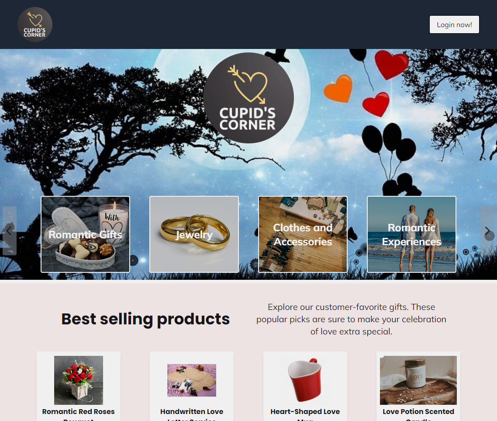
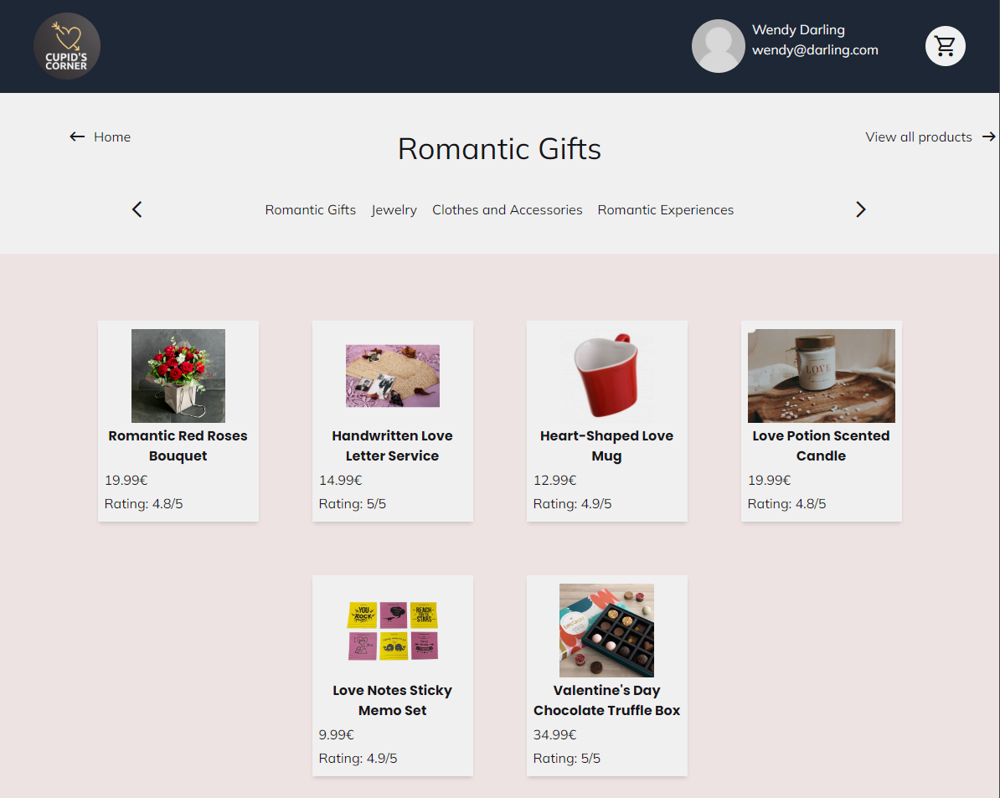
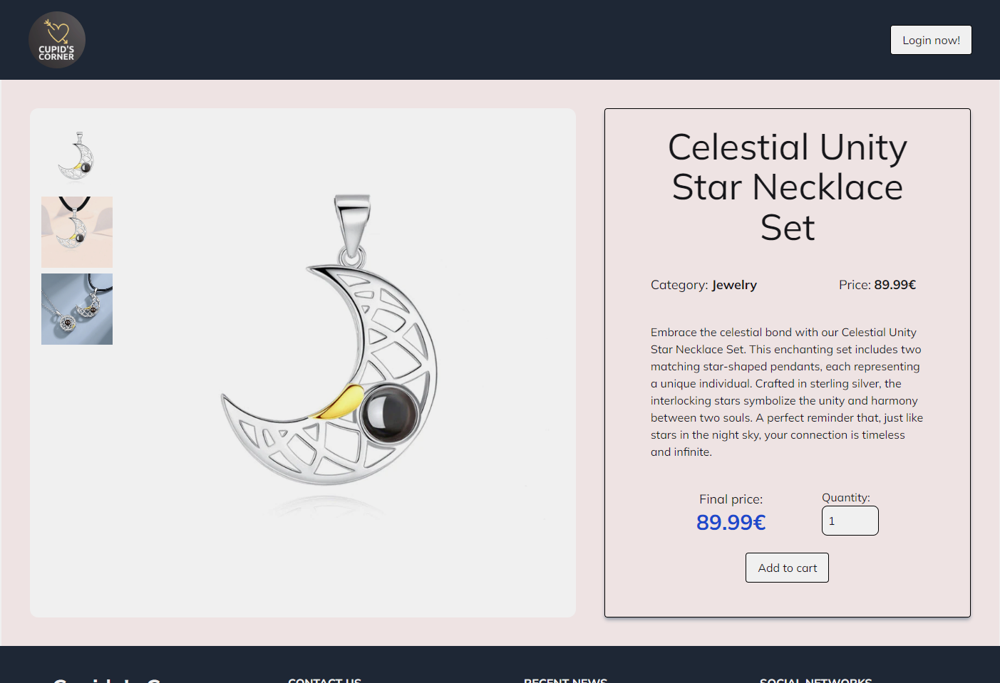

# StudySnap

## Weolcome

🚀 Welcome to Cupid's Corner – where social networking meets AI magic! 🌐✨ Share your thoughts on diverse topics, chat with our AI, and enjoy AI-generated summaries. Customize content, comment, like, and save posts. 📝💬 Explore effortlessly with easy search and revisit your last seen posts. Join the conversation! 🚀🔍 #SmartSocializing

## Description

This application is a social network that allows users to share text content on various topics. Additionally, it features a chatbot function where users can interact with an AI to ask questions related to those topics. The text shared on the platform consists of summaries generated by the AI based on the previous user conversation. If a user finds that the generated text needs adjustments, they can easily edit and customize it to their liking.

Among its other functionalities, users can comment on posts by other users, like and save posts, provide suggestions for improvements or report errors in the posted content. Users can also search for posts based on the its title content. Furthermore, the application allows users to conveniently access and view the last 15 posts they visited.

**Live Demo: [StudySnap Demo](https://studysnap.netlify.app)**

    
    

    
    

## Built with:
- React JS
- TypeScript
- Tailwind CSS
- Node.js
- Express
- MongoDB (Mongoose)

## Fuctional description

### Use cases
- Acess to all products available without logging in
- View the best rating products
- View offers and discounts available
- View all existing products categories
- Acces to the products by category
- Log in to be able to buy a product and upload one of your own
- Click on a product to see all information about it
- Click on 'add to cart' button to add it to the cart selecting the quantity of the product you want
- Click on the cart image in header to see the amount of products you are going to buy and the total price of it
- Remove a product from cart
- Click on avatar image in header to access profile page
- View all own products in profile page
- Upload a product to  website from profile page
- View the product preview while introducing the product data
- Delete a product on the website from profile page
- Change your avatar image
- Log out

## Technical description

### Data model

User
- id (oid)
- name (string)
- email (string)
- password (string)
- avatar (string)
- favs (oid array, refers to Post id)
- seenLately (oid array, refers to Post id)

Product
- id (string)
- author (oid, refers to User id)
- title (string)
- text (string)
- date (object)
- likes (oid array, refers to User id)
- visible (boolean)
- comments (array with comments)

ProductToBuy
- id (oid)
- productId (oid)
- productQuantity (number)
- finalPrice (number)

### Planning

https://trello.com/b/adykYaSC/cupidos-corner